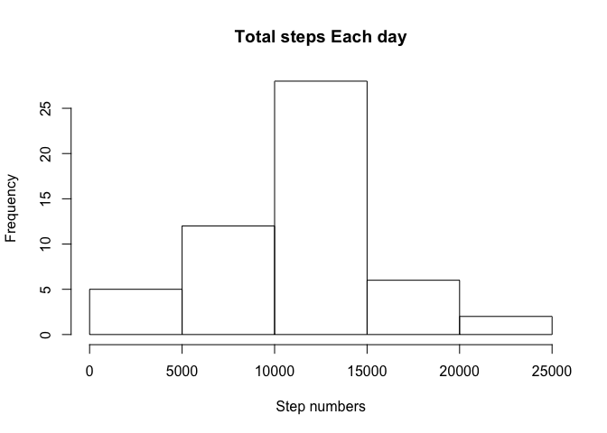
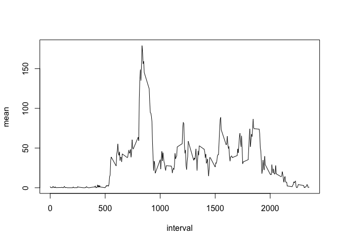
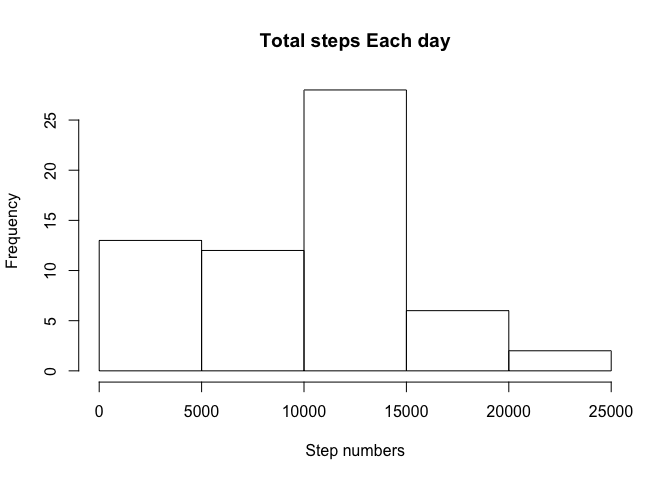
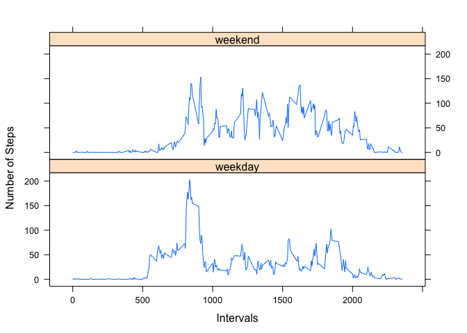

## Loading and preprocessing the data

```r
activity <- read.csv("~/Desktop/RepData_PeerAssessment1/activity.csv")
```

## What is mean total number of steps taken per day?


```r
library(dplyr)
```

```
## 
## Attaching package: 'dplyr'
```

```
## The following objects are masked from 'package:stats':
## 
##     filter, lag
```

```
## The following objects are masked from 'package:base':
## 
##     intersect, setdiff, setequal, union
```

```r
library(lattice)
```
Here we do the sum

```r
data_1<-group_by(activity,date)
#group data according to the date
sum_1<-summarize(data_1,sum = sum(steps))
sum_1
```

```
## # A tibble: 61 x 2
##    date         sum
##    <fct>      <int>
##  1 2012-10-01    NA
##  2 2012-10-02   126
##  3 2012-10-03 11352
##  4 2012-10-04 12116
##  5 2012-10-05 13294
##  6 2012-10-06 15420
##  7 2012-10-07 11015
##  8 2012-10-08    NA
##  9 2012-10-09 12811
## 10 2012-10-10  9900
## # … with 51 more rows
```
Here we plot the histogram

```r
hist(sum_1$sum, main = "Total steps Each day", xlab="Step numbers")
```

<!-- -->
Mean of total steps taken each day

```r
#Mean number is as followed:
sum(sum_1$sum,na.rm = TRUE)/nrow(sum_1)
```

```
## [1] 9354.23
```

```r
# Median is as followed:
median(sum_1$sum,na.rm = TRUE)
```

```
## [1] 10765
```

## What is the average daily activity pattern?

```r
data_2<-group_by(activity,interval)
mean_2<-summarize(data_2,mean = sum(steps,na.rm = TRUE)/nrow(sum_1))
mean_2
```

```
## # A tibble: 288 x 2
##    interval   mean
##       <int>  <dbl>
##  1        0 1.49  
##  2        5 0.295 
##  3       10 0.115 
##  4       15 0.131 
##  5       20 0.0656
##  6       25 1.82  
##  7       30 0.459 
##  8       35 0.754 
##  9       40 0     
## 10       45 1.28  
## # … with 278 more rows
```

```r
#plot the average daily activity pattern
with(mean_2,plot(interval,mean,type="l"))
```

<!-- -->

```r
#The 5-minute interval, on average across all the days in the dataset, contains the maximum number of steps is as followed:
which(mean_2$mean==max(mean_2$mean))
```

```
## [1] 104
```

## Imputing missing values
total number of missing values in the dataset (i.e. the total number of rows with NA)

```r
nrow(activity)-sum(complete.cases(activity))
```

```
## [1] 2304
```

```r
#or we can 
test_data_frame<-as.data.frame(table(activity$steps,useNA = "ifany"))
test_data_frame[nrow(test_data_frame),"Freq"]
```

```
## [1] 2304
```

filling in all of the missing values in the dataset

```r
#first calculate the average steps each day averaged by intervals
tem_data<-group_by(activity,date)
tem_mean<-as.data.frame(summarize(tem_data,mean = sum(steps,na.rm = TRUE)/nrow(sum_1)))
#modify NA with mean of that day
for (i in c(1:nrow(activity))) {
  if (complete.cases(activity[i,])==FALSE){
    cor_date<-as.POSIXct(activity[i,"date"] )
    cor_index<-which(as.POSIXct(tem_mean$date) == cor_date)
    activity[i,"steps"] = tem_mean[cor_index, "mean"]
  } else {}
}
#new dataset with filled value
new_activity<-activity
head(new_activity)
```

```
##   steps       date interval
## 1     0 2012-10-01        0
## 2     0 2012-10-01        5
## 3     0 2012-10-01       10
## 4     0 2012-10-01       15
## 5     0 2012-10-01       20
## 6     0 2012-10-01       25
```


```r
#histogram
data_2<-group_by(new_activity,date)
sum_2<-summarize(data_2,sum=sum(steps))
hist(sum_2$sum, main = "Total steps Each day", xlab="Step numbers")
```

<!-- -->

```r
#Mean number is as followed:
sum(sum_2$sum)/nrow(sum_2)
```

```
## [1] 9354.23
```

```r
# Median is as followed:
median(sum_2$sum)
```

```
## [1] 10395
```
We can see after assign NA with mean of that day, the result is nearly the same, while 
there is little difference between two medians.


## Are there differences in activity patterns between weekdays and weekends?

```r
for (j in c(1:nrow(new_activity))) {
  if (weekdays(as.POSIXct(activity[j,"date"])) %in% c("Monday","Tuesday","Wednesday","Thursday","Friday")){
    new_activity[j,"day"]="weekday"
  }
  else{
    new_activity[j,"day"]="weekend"
  }
}
head(new_activity)
```

```
##   steps       date interval     day
## 1     0 2012-10-01        0 weekday
## 2     0 2012-10-01        5 weekday
## 3     0 2012-10-01       10 weekday
## 4     0 2012-10-01       15 weekday
## 5     0 2012-10-01       20 weekday
## 6     0 2012-10-01       25 weekday
```
calculate weekday days and weekend days

```r
grp_dy<-group_by(new_activity,date)
grp_sum<-summarize(grp_dy,sum = sum(steps))
grp_sum<-as.data.frame(grp_sum)
for (p in c(1:nrow(grp_sum))) {
  if (weekdays(as.POSIXct(grp_sum[p,"date"])) %in% c("Monday","Tuesday","Wednesday","Thursday","Friday")){
    grp_sum[p,"day"]="weekday"
  }
  else{
    grp_sum[p,"day"]="weekend"
  }
}
table(grp_sum$day)
```

```
## 
## weekday weekend 
##      45      16
```
so weekday has 45 and weekend has 16.

plotting now

```r
weekday_data<-subset(new_activity, day=="weekday")
group_weekday<-group_by(weekday_data,interval)
sum_wkdy<-summarise(group_weekday,mean = sum(steps)/45)
sum_wkdy$day<-"weekday"

weekend_data<-subset(new_activity,day=="weekend")
group_weekend<-group_by(weekend_data,interval)
sum_wked<-summarise(group_weekend,mean = sum(steps)/16)
sum_wked$day<-"weekend"

test_d<-merge(sum_wked,sum_wkdy,all=TRUE)
xyplot(mean~interval|day,data=test_d,layout=c(1,2),xlab ="Intervals",ylab="Number of Steps ",type="l")
```

<!-- -->

